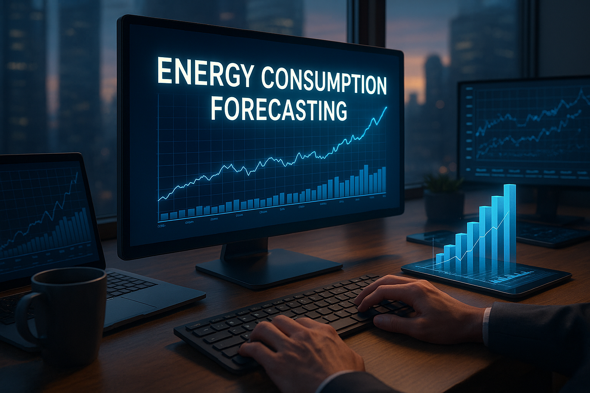

# ⚡ Hourly Energy Consumption Forecasting (LSTM)

This Streamlit app forecasts hourly power consumption using an LSTM model trained on PJM Interconnection data. It predicts usage for 1 to 30 days ahead and visualizes trends using interactive charts.

## 📊 Dataset
- **Source**: PJM Interconnection
- **Columns**: Datetime, PJMW_MW

## 🧠 Model
- Long Short-Term Memory (LSTM)
- Input: Last 24 hourly values
- Output: Forecast next N hours

## 🚀 Features
- Upload time series CSV
- Interactive forecast duration
- LSTM prediction visualization
- Download results as CSV

## 📸 Preview


## 🛠 Installation

```bash
pip install -r requirements.txt
streamlit run app.py
